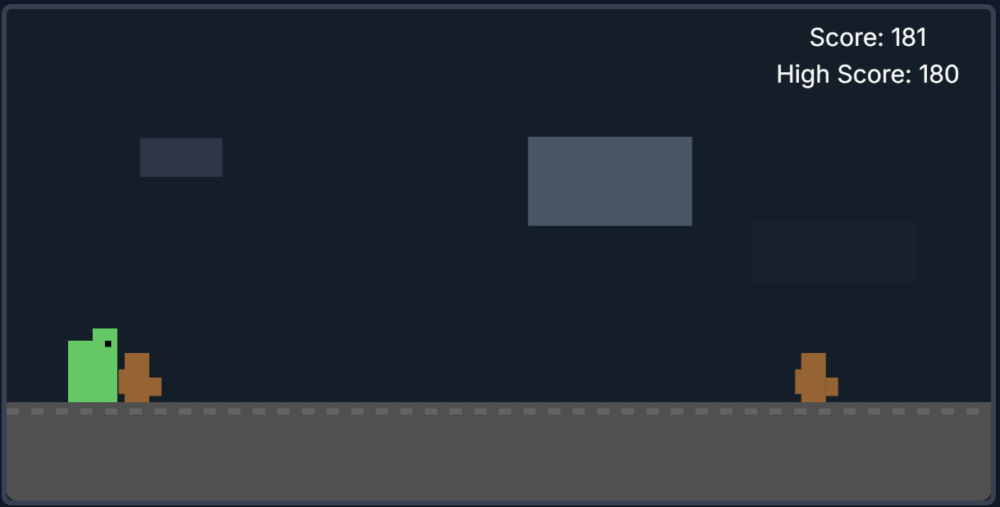

# Pixel Dino Run ✨

A classic endless runner game with pixelated retro aesthetics, enhanced with AI-generated storytelling! After each game, generate a unique, epic (and slightly silly) story about your dinosaur's adventure based on your score.

 *<!-- Add actual screenshot file later -->*

[Vibe-code a kids game with Gemini and publish with Firebase!](https://codelabs.developers.google.com/codelabs/)

## Gemini API

**Add you API Key to sketch.js file**
*// Gemini API related variables
*let dinoFact = 'API_Key'; // Your API Key to store the generated dinosaur fact
*let isLoadingFact = false; // To show loading state for the API call

## Features

🏃 **Classic Endless Runner**  
Jump over obstacles and watch your score climb  

🖼️ **Pixel Art Style**  
Nostalgic aesthetic with crisp pixel graphics  

📱 **Responsive Design**  
Adapts to all screen sizes and orientations  

🤖 **AI Story Generation**  
Powered by Gemini API - get personalized dino tales after each game  

🎮 **Simple Controls**  
Easy to pick up and play for all ages  

## How to Play

1. **Start** - Game begins automatically when loaded  
2. **Jump**  
   - *Desktop*: SPACEBAR  
   - *Mobile*: Tap anywhere on screen  
3. **Avoid Obstacles** - Clear cacti to keep running  
4. **Score** - Increases as you survive longer  
5. **Game Over** - Collide with an obstacle to end the run  
6. **Generate Story** - Click "✨ Generate Dino's Epic Tale" button post-game  
7. **Restart** - Press 'R' key or tap screen (outside modal)  

## AI Storytelling

Our integration with Gemini API crafts unique narratives featuring:
- Epic adventures scaled to your score  
- Humorous twists on your dino's journey  
- Personalized achievements based on performance  

Example story:  
*"Sir Dino the Unstoppable (Score: 247) bravely leaped over 43 cacti before tripping on the tiniest pebble. Legend says he's still complaining about it in dinosaur heaven."*

## Technologies

| Component       | Technology          |
|----------------|---------------------|
| Core Framework | HTML5 + CSS3        |
| Game Engine    | JavaScript (p5.js)  |
| AI Integration | Gemini API          |
| Design         | Pixel Art           |

## Development Notes

🔒 **Security**  
- Gemini API key handled securely via Canvas environment  
- No client-side exposure of sensitive data  

🎨 **Design Choices**  
- `noSmooth()` for crisp pixel rendering  
- Parallax scrolling hills for depth  
- Minimalist UI for retro authenticity  

